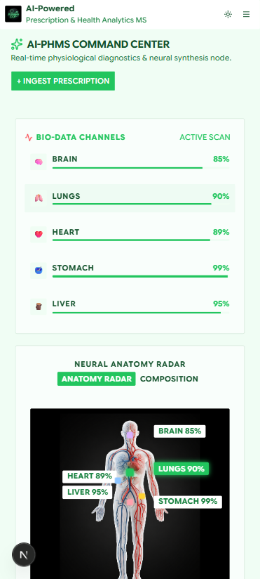
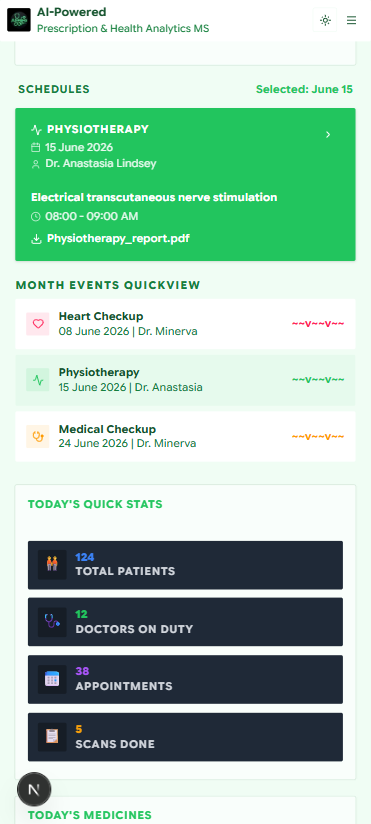
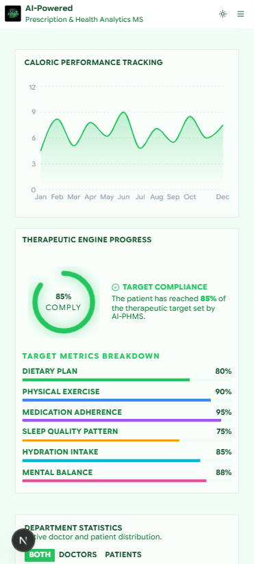

# AI-Powered Prescription and Health Analytics Management System (AI-PHMS)

## Instant AI Prescription Extraction and Lifetime Clinical Analytics Command Center

*Bridging automated prescription parsing with real-time health timeline tracking, vitals analytics, and antibiotic tracking.*

[](https://ai-phms.vercel.app) [](https://nextjs.org/) [](https://vercel.com/) [](https://tailwindcss.com/)

---

## Table of Contents

- [Overview](#overview)
- [The Problem and The Solution](#the-problem-and-the-solution)
- [Live Links and UI Preview](#live-links-and-ui-preview)
- [Business Value and SEO](#business-value-and-seo)
- [Key Features](#key-features)
- [Project Tasks and Phases](#project-tasks-and-phases)
- [Tech Stack and Architecture](#tech-stack-and-architecture)
- [Project Structure](#project-structure)
- [Installation and Setup](#installation-and-setup)
- [Production Deployment](#production-deployment)
- [Social and Contributing](#social-and-contributing)

---

## Overview

**AI-PHMS** is an advanced frontend prototype designed to streamline patient document organization and empower doctors with real-time, comprehensive health history analytics before consultations. Meticulously engineered using **Next.js 16 (App Router)**, **React 19**, **Tailwind CSS 4**, and **Shadcn UI**, the platform operates as a secure client-side ledger utilizing browser `localStorage` as its database.

By dragging-and-dropping prescriptions or test report images/PDFs, patients trigger a Server Action middleware integrating **Google Gemini** or **OpenAI** APIs. The AI extracts doctor names, consultation dates, symptom cases, vitals (such as respiratory rate and blood pressure), medicines, and diagnostic lab test values. Doctors can search patient IDs to view structured analytics, including a dedicated **Antibiotic Tracker**, categorized medicine cards (Vitamins, Calcium, Gastric), and chronological test results.

---

## The Problem and The Solution

> **Health records should be instant, legible, and structurally organized.**

Patient-provided histories are often fragmented, consisting of scattered physical prescriptions, illegible handwriting, or unorganized PDF scans. In a busy clinic, doctors lack the time to trace patient records, resulting in unsafe prescription duplication, overlooked medication conflicts, or missed changes in diagnostic test results.

| The Problem | AI-PHMS's Solution |
| :--- | :--- |
| Disjointed medical records in physical sheets or unsorted PDFs | Drag-and-drop document hub matching files with patient timelines |
| Hand-written prescriptions are difficult to read and classify | Server-side AI API extracts, structures, and classifies medication lists |
| Unknown lifetime exposure to critical drug classes (e.g., Antibiotics) | Dedicated Antibiotic Tracker displaying total usage and historical dates |
| Loose and scattered vital signs and lab results across time | Automatic extraction and chronological tracking of Vitals & Lab Test metrics |
| Risk of patient data loss and complex database integrations | Secure, self-contained browser `localStorage` ledger (no external DB required) |

---

## Live Links and UI Preview

- **GitHub Repository:** [https://github.com/CoderGUY47/ai-phms](https://github.com/CoderGUY47/ai-phms)
- **Live Deployment Website:** [https://ai-phms.vercel.app/](https://ai-phms.vercel.app/)

### Desktop Command Center


### Mobile Responsive Views

| Patient Portal | Doctor Portal | Admin Portal |
| :---: | :---: | :---: |
|  |  |  |

*AI-PHMS UI Preview — Desktop Command Center and Mobile Responsive views.*

---

## Business Value and SEO

By balancing modern aesthetics with robust local security, AI-PHMS delivers immediate value:

| Feature | Impact |
| :--- | :--- |
| **Instant Clinical Insights** | Doctors instantly see patient history summaries, saving critical check-up minutes |
| **Clinical Risk Prevention** | The Antibiotic Tracker helps prevent over-prescription and drug-resistance risks |
| **Data Independence** | Browser-isolated storage ensures immediate accessibility with zero network latency |
| **SEO & Access Optimization** | Search Engine indexing and semantic structures maximize organic reach for diagnostic systems |

---

## Key Features

- **Hospital Command Center** — Modern landing dashboard visualizing body-metric analytics (Brain, Lungs, Heart, Stomach, Liver), caloric tracking, and target compliance.
- **Patient Portal (AI-Powered)** — Drag-and-drop file upload for prescriptions (PDF, PNG, JPG) using real AI middleware to extract doctor details, cases, medicines, and lab values.
- **Doctor Portal** — Patient search index via unique ID, displaying lifetime health dashboards, Antibiotic Tracker, medication categorization blocks, and chronological test histories.
- **Deep-Dive Consultation Details** — View the complete, original breakdown of any single consultation date in a single dialog modal.
- **Admin Portal** — Manage access directories (Mock-register, suspend, activate, delete profiles) and inspect system audit logs.
- **System Configuration** — Toggle light/dark mode and use configuration controls to reload seed datasets or purge local storage instantly.

---

## Project Tasks and Phases

### Phase 1 — Patient Portal and AI Extraction Foundation

- **Project Setup**
  - [x] Next.js project bootstrap with TypeScript & Tailwind CSS
  - [x] Forced border-radius global layout tweaks (`rounded-xs` 2px border radius)
- **AI Processing Module**
  - [x] File upload center supporting images (PNG, JPEG) and PDF files
  - [x] Google Gemini & OpenAI API integration Server Actions
  - [x] Structured JSON Schema outputs for clinical metadata extraction
- **Local Ledger Storage**
  - [x] Date-wise parsing and storage of AI records inside browser `localStorage`

---

### Phase 2 — Doctor Portal and Clinical Tracking

- **Patient Search Index**
  - [x] Instant search index matching Patient ID or name
- **Antibiotic Tracker**
  - [x] Dedicated section showing lifetime usage, medicine name, and date history
- **Medication Categorization Cards**
  - [x] Separate blocks grouping historical data for Vitamins, Calcium, and Gastric meds
- **Lab Test Analytics**
  - [x] Chronological table view displaying past test results
- **Deep-Dive Dialog**
  - [x] Dialog modal displaying full original details of a consultation date

---

### Phase 3 — Admin Controls and Audit System

- **Admin Dashboard**
  - [x] Stats cards tracking active patients, active doctors, and total parsed docs
- **Access Directory**
  - [x] Register new profiles, suspend, activate, or delete patient and doctor IDs
- **System Audit Logs**
  - [x] Log ledger tracking successful document parses, registration, and status edits
- **Settings & Seed Controls**
  - [x] Pure localStorage flush controls and seed profile reloader

---

## Tech Stack and Architecture

| Technology | Category | Purpose / Notes |
| :--- | :--- | :--- |
| **Next.js 16** | Frontend Framework | App Router, Server Actions & SEO optimization |
| **React 19** | Library | Concurrent rendering, modern hooks, and state |
| **TypeScript** | Language | Strict type safety with zero `any` usage |
| **Tailwind CSS 4** | Styling | Utility-first styling with custom global style rules |
| **Shadcn UI** | UI Primitives | Radix-based accessible UI components |
| **Google Gemini SDK** | AI SDK | Structured schema extraction (v2 SDK `@google/genai`) |
| **OpenAI SDK** | AI SDK | Structured output completion schema integrations |
| **React Dropzone** | File Uploader | Drag-and-drop file upload handler |
| **React Toastify** | Notifications | Toast notifications for async state updates |
| **Lucide React** | Icons | Consistent modern iconography |

---

## Project Structure

```text
src/
├── app/                          # Next.js App Router pages
│   ├── actions/                  # Server Actions (process-document, extract.py)
│   ├── admin/                    # Admin portal
│   ├── appointments/             # Appointment listings
│   ├── doctor/                   # Doctor portal
│   ├── doctors/                  # Doctors directory
│   ├── patient/                  # Patient portal (AI uploader)
│   ├── patients/                 # Patients directory
│   ├── reports/                  # Report listings
│   ├── globals.css               # Global styling overrides (border radius & neon badges)
│   ├── layout.tsx                # Root layout & providers
│   └── page.tsx                  # Hospital Dashboard (Landing)
│
├── components/
│   ├── theme-toggle.tsx          # Light / Dark theme controller
│   ├── sidebar.tsx               # Navigation menu
│   ├── header.tsx                # Search bar & logged-in doctor navbar info
│   └── ui/                       # Atomic UI: Button, Dialog, Card, Table, Badge, etc.
│
├── hooks/                        # Custom React hooks (useMedicalRecords)
├── lib/                          # Schemas & utilities
├── types/                        # Shared TypeScript definitions (index.ts)
```

---

## Installation and Setup

### Prerequisites

- Node.js `v18.x` or higher
- npm or yarn

### Installation

```bash
# 1. Clone the repository
git clone https://github.com/CoderGUY47/ai-phms.git
cd ai-phms

# 2. Install dependencies
npm install

# 3. Set up environment variables
# Create a .env.local file in the root directory and add your API keys:
# GEMINI_API_KEY=your_gemini_api_key
# OPENAI_API_KEY=your_openai_api_key

# 4. Start the development server
npm run dev
```

Open [http://localhost:3000](http://localhost:3000) in your browser.

---

## Production Deployment

- **Frontend Hosting:** Deployed on **Vercel** (`ai-phms.vercel.app`).
- **Deployment Pipeline:** Integrated with GitHub for automated CI/CD.

---

## Social and Contributing

Produced with absolute dedication and precision by **[CoderGUY47](https://github.com/CoderGUY47)**.

*Join us in engineering the future of AI-powered clinical operations!*

[](https://github.com/CoderGUY47)
